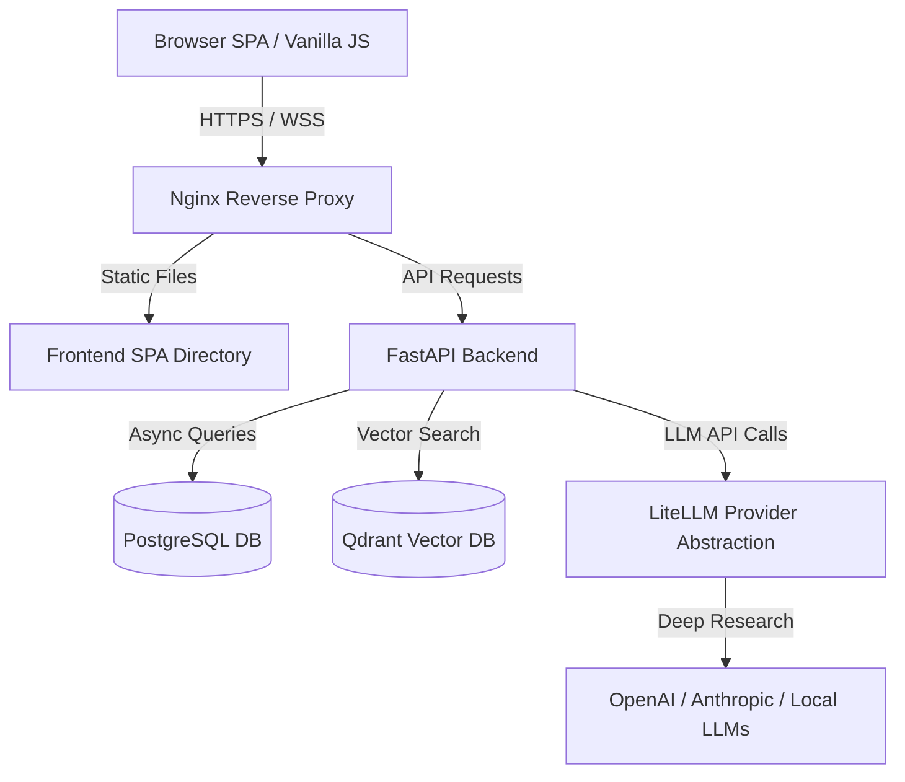

# 🧠 Agentic AI Research Platform

An enterprise-grade, self-hostable **Agentic AI Research Platform** designed to perform autonomous deep research, aggregate info, run semantic searches, analyze findings, and write professional synthesis reports.

The platform uses a parallelized, multi-agent orchestrator executing a **PRAR (Perceive, Reason, Act, Reflect)** architecture loop with real-time WebSocket logs and a sleek, modern UI.

---

## 🏗️ Architecture Overview

The application is built using a modern, decoupled microservices stack:



### Key Technical Stack
* **Frontend:** Clean, responsive SPA using HTML5, Vanilla JavaScript, Custom CSS, and real-time WebSockets.
* **Backend:** FastAPI (Python 3.12) with asynchronous handlers and WebSocket endpoints.
* **Database (Relational):** PostgreSQL with SQLAlchemy 2.0 Async engine.
* **Vector Database:** Qdrant for semantic research chunk indexing and memory retrieval.
* **Agent Engine:** Asynchronous Python orchestrator utilizing **LiteLLM** for vendor-agnostic LLM integration.

---

## 🌟 Features

* **Multi-Agent Collaboration:** Dedicated agents for Planning, Researching, Analyzing, and Writing collaborate asynchronously to draft reports.
* **Semantic Vector Memory:** Integrates Qdrant to chunk and index retrieved web sources, ensuring agents reference ground-truth data.
* **Real-time Live Logs:** Watch the agents' thought processes, search actions, and synthesis steps in real time via WebSockets.
* **Interactive Dashboard:** Create, manage, and delete previous research sessions.
* **Export Options:** Download finalized reports as styled PDF documents or view them directly as formatted Markdown.
* **Security & Auth:** Secure JWT-based authentication for users with individual encryption keys for storing integration API keys.

---

## 🚀 Getting Started

### Prerequisites
Make sure you have [Docker](https://docs.docker.com/get-docker/) and [Docker Compose](https://docs.docker.com/compose/install/) installed.

### Run with Docker Compose (Recommended)

1. **Clone the Repository:**
   ```bash
   git clone https://github.com/your-username/research-ai-agent.git
   cd research-ai-agent
   ```

2. **Configure Environment Variables:**
   Copy the example environment file and fill in your keys:
   ```bash
   cp .env.example .env
   ```
   *Note: Add your Tavily API key and LLM provider credentials (e.g., OpenAI API Key) inside `.env`.*

3. **Start the Stack:**
   ```bash
   docker compose up --build
   ```

4. **Access the Platform:**
   * **Web Application:** Open [http://localhost](http://localhost) in your browser.
   * **Interactive API Docs:** Navigate to [http://localhost/api/docs](http://localhost/api/docs).

---

## 🛠️ Local Development (Custom Overrides)

If you are running database services (like Postgres or Qdrant) locally on your host machine and run into port conflicts during Docker development, you can override the default exposed ports.

To do this, create a `docker-compose.override.yml` file (which is git-ignored):
```yaml
services:
  postgres:
    ports:
      - "5433:5432" # Maps PostgreSQL to host port 5433

  qdrant:
    ports:
      - "6335:6333" # Maps Qdrant to host port 6335

  nginx:
    ports:
      - "8080:80"   # Maps Frontend to host port 8080
```
When you run `docker compose up`, Docker will automatically merge these overrides. Access the UI at [http://localhost:8080](http://localhost:8080).
